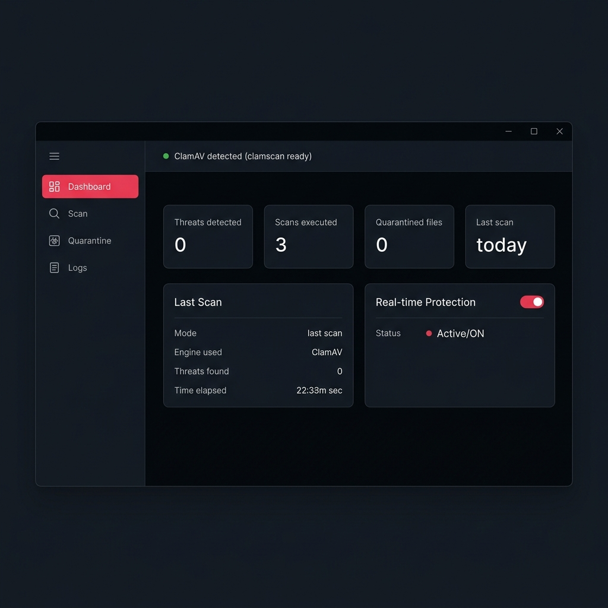
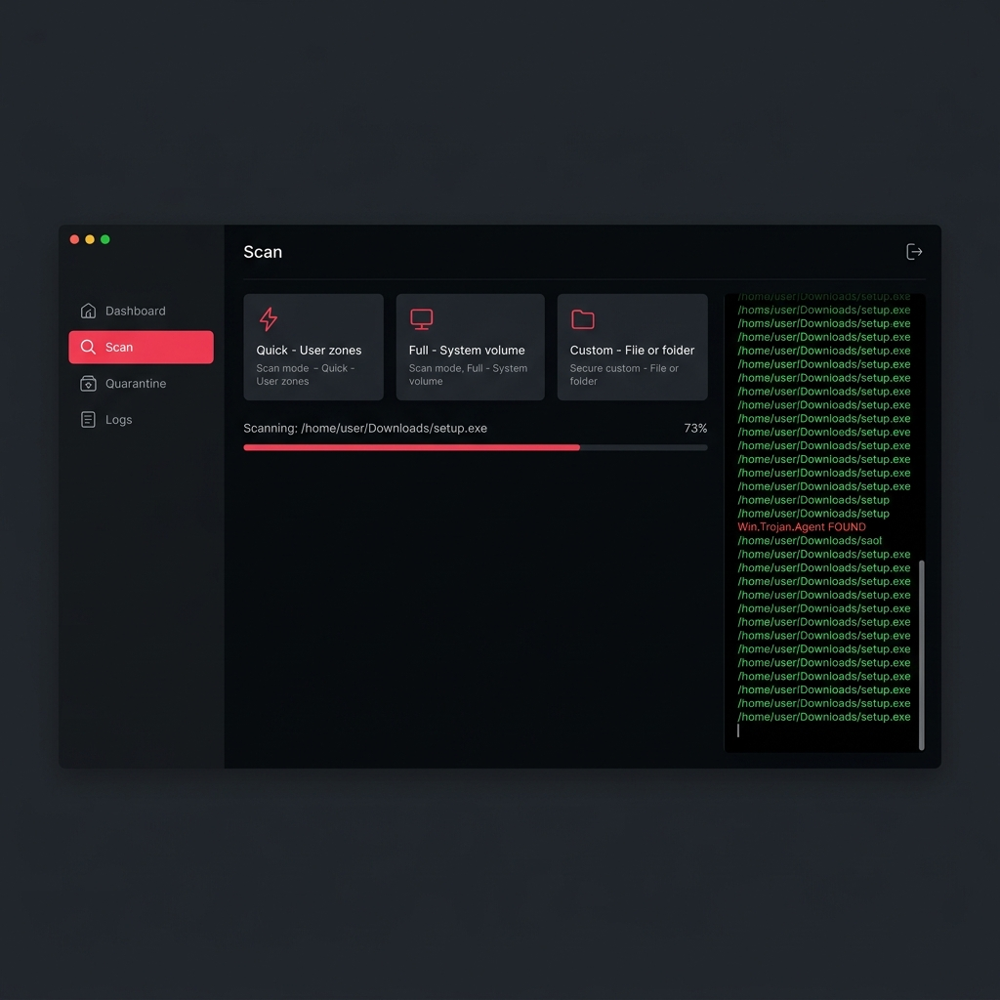

<div align="center">


# ClamAVClient

**Antivirus desktop multi-plateforme — Rust · Tauri · ClamAV**

[](https://github.com/AnARCHIS12/ClamAVClient/actions/workflows/build.yml)
[](https://github.com/AnARCHIS12/ClamAVClient/releases/latest)
[](LICENSE)
[](https://github.com/AnARCHIS12/ClamAVClient/releases)
[](https://tauri.app)
[](https://www.rust-lang.org)

[Site Web](https://anarchis12.github.io/ClamAVClient/) · [Telechargements](https://github.com/AnARCHIS12/ClamAVClient/releases) · [Issues](https://github.com/AnARCHIS12/ClamAVClient/issues)

</div>

---

## Presentation

ClamAVClient est une interface graphique moderne pour ClamAV, construite avec Tauri et Rust. Elle regroupe dans une application unique le scan, la quarantaine, l'historique des analyses, les mises a jour de signatures et la surveillance temps reel des dossiers.

L'objectif est de proposer une application legere, moderne et facile a distribuer sur Linux, Windows et macOS, sans aucune configuration requise pour l'utilisateur final.

---

## Captures d'ecran

<div align="center">

| Dashboard | Scan en cours |
|:---------:|:-------------:|
|  |  |

</div>

---

## Telechargements

Les builds sont disponibles sur [GitHub Releases](https://github.com/AnARCHIS12/ClamAVClient/releases) :

| Plateforme | Format | Lien |
|------------|--------|------|
| Linux | `.deb` (Ubuntu/Debian) | [Telecharger](https://github.com/AnARCHIS12/ClamAVClient/releases/latest/download/ClamAvClient_0.1.0_amd64.deb) |
| Linux | `.rpm` (Fedora/RHEL) | [Telecharger](https://github.com/AnARCHIS12/ClamAVClient/releases/latest/download/ClamAvClient-0.1.0-1.x86_64.rpm) |
| Linux | `.AppImage` | [Telecharger](https://github.com/AnARCHIS12/ClamAVClient/releases/latest/download/ClamAvClient_0.1.0_amd64.AppImage) |
| macOS | `.dmg` | [Telecharger](https://github.com/AnARCHIS12/ClamAVClient/releases/latest/download/ClamAvClient_0.1.0_x64.dmg) |
| Windows | `.msi` | [Telecharger](https://github.com/AnARCHIS12/ClamAVClient/releases/latest/download/ClamAvClient_0.1.0_x64_fr-FR.msi) |

---

## Fonctionnalites

- **Dashboard** — etat du moteur, statistiques et resume du dernier scan
- **Scan** rapide, complet ou personnalise avec progression en temps reel
- **Quarantaine** avec restauration ou suppression des fichiers suspects
- **Logs** JSON conserves localement pour l'historique complet
- **Notifications systeme** en cas de menace detectee
- **Protection temps reel** des dossiers surveilles
- **Scan automatique** du dossier `Downloads`
- **Support optionnel de `clamdscan`** pour de meilleures performances
- **Mises a jour automatiques** des signatures (freshclam, intervalle configurable)
- **Demarrage automatique** de la protection au lancement de l'app
- **Elevation de droits automatique** sur toutes les plateformes (pkexec, UAC, osascript)

---

## Architecture

```
ClamAVClient/
├── index.html               # Template HTML de l'app Tauri
├── src/
│   ├── main.js              # Logique frontend (Vanilla JS)
│   └── styles.css           # Styles (theme sombre rouge)
├── src-tauri/
│   ├── src/
│   │   ├── main.rs          # Point d'entree Tauri
│   │   ├── commands.rs      # Commandes exposees au frontend
│   │   ├── clamav.rs        # Moteur de scan ClamAV
│   │   ├── watcher.rs       # Protection temps reel (inotify)
│   │   ├── auto_update.rs   # Mise a jour automatique des signatures
│   │   ├── quarantine.rs    # Gestion de la quarantaine
│   │   ├── storage.rs       # Persistance locale (JSON)
│   │   ├── models.rs        # Structures de donnees
│   │   └── paths.rs         # Chemins systeme multi-plateforme
│   └── scripts/
│       ├── postinstall-linux.sh   # Post-install deb/rpm
│       ├── preremove-linux.sh     # Pre-desinstall deb/rpm
│       ├── postinstall-windows.ps1
│       └── preremove-windows.ps1
└── docs/                    # Landing page GitHub Pages
```

---

## Prerequis de build

### Ubuntu / Debian

```bash
sudo apt install clamav clamav-daemon libwebkit2gtk-4.1-dev build-essential
```

### Fedora / RHEL

```bash
sudo dnf install clamav clamav-freshclam clamd webkit2gtk4.1-devel
```

### macOS

```bash
brew install clamav
xcode-select --install
```

### Windows

Installer [ClamAV](https://www.clamav.net/) et les [Visual Studio C++ Build Tools](https://visualstudio.microsoft.com/visual-cpp-build-tools/).

---

## Developpement

```bash
# Installer les dependances
npm install

# Preparer le runtime ClamAV embarque
npm run prepare:clamav

# Lancer en mode developpement
npm run tauri dev

# Lancer avec elevation de droits (Linux/macOS)
npm run dev:elevated
```

## Build

```bash
npm install
npm run prepare:clamav

# Build complet (format selon la plateforme)
npm run build:desktop
```

---

## Release

```bash
# Creer un tag => declenche le build GitHub Actions et attache les artefacts
git tag v1.2.0
git push origin v1.2.0
```

Le workflow GitHub Actions compile simultanement sur Linux, macOS et Windows et publie les artefacts sur la release.

---

## Droits administratifs

ClamAVClient necessite des droits eleves pour analyser les fichiers systeme :

- **Linux** — elevation via `pkexec` (graphique) ou `sudo`
- **macOS** — elevation via `osascript`
- **Windows** — manifeste UAC integre au bundle MSI

---

## Licence

Ce projet est sous licence [MIT](LICENSE).

## Contribution

Les contributions sont les bienvenues. Forkez le projet, creez une branche, commitez vos modifications et ouvrez une Pull Request.

## Support

Ouvrez une [issue GitHub](https://github.com/AnARCHIS12/ClamAVClient/issues) pour tout bug ou question.
